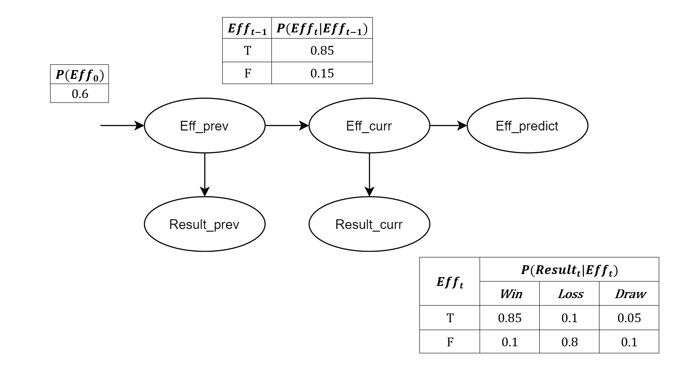
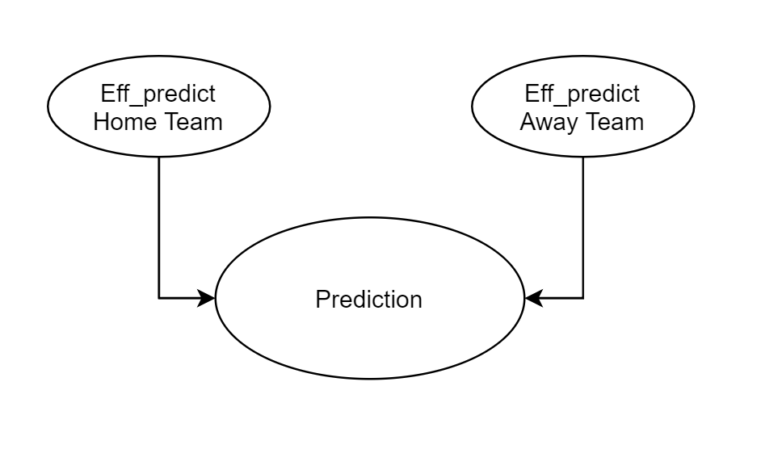

# Football Predictions

Projekt polega na stworzeniu systemu przewidującego wyniki meczów piłki nożnej wykorzystującego probabilistyczne modele grafowe. System ma przewidywać jaki będzie wynik następnego meczu, mając do dyspozycji wyniki już rozegranych meczy.

---

# Opis projektu

Opracowany system przewiduje wynik meczu na podstawie skuteczności dwóch drużyn. Do określenia każdej z nich zastosowano probabilistyczny model grafowy, a konkretniej sieć Bayesowską. Korzysta ona z procesu Markova, ponieważ następny stan zależy od stanu poprzedniego. W modelu występują dwa główne czynniki: czynnik związany z obserwacjami (Results) i czynnik związany z przejściem pomiędzy stanami w czasie (Efficiency).

Użytkownik na standardowe wejście podaje 3 łańcuchy znaków oddzielone znakami nowej linii, oznaczające odpowiednio: *Date*, *HomeTeam* oraz *AwayTeam*. Dla każdej drużyny rozgrywającej dany mecz tworzony jest osobny model sieci Bayesowskiej oraz obliczany jest rozkład prawdopodobieństwa skuteczności zespołu.

Po określeniu skuteczności drużyn na podstawie wyników z poprzednich spotkań, rozważana jest również pozycja w rankingu. Jest on tworzony na podstawie wszystkich goli zdobytych przez daną drużynę. Dzięki niemu, zawodnicy na czele rankinu mają większe prawdopodobieństwo na zwycięstwo, a ich pojedyncze porażki nie wpływają tak mocno na końcową predykcję. 

Ostateczny wynik meczu określany jest na podstawie porównania skuteczności obu drużyn. Jeśli ich różnica nie przekracza 0.8 to na wyjściu pojawia się informacja o remisie (D). W przeciwnym wypadku wyświetlana jest informacja o zwycięstwie skuteczniejszej drużyny: gospodarzy (H) lub gości (A).

# Podsumowanie

Otrzymane wyniki są jedynie prognozą faktycznych rezultatów rozgrywanych spotkań. Są sytuacje, których czasami nie da się przewidzieć, jak np. niedyspozycja zawodnika, niespodziewana choroba gracza lub taktyczne zmiany składu drużyny. Sport jest dziedziną, w której może zdarzyć się wszystko i bardzo trudno jest przewidzieć wynik meczu. Jednak biorąc pod uwagę skuteczność danych drużyn oraz ich wyniki z poprzednich spotkań, można z dobrym przybliżeniem określić prawdopodobny rezultat meczu.
