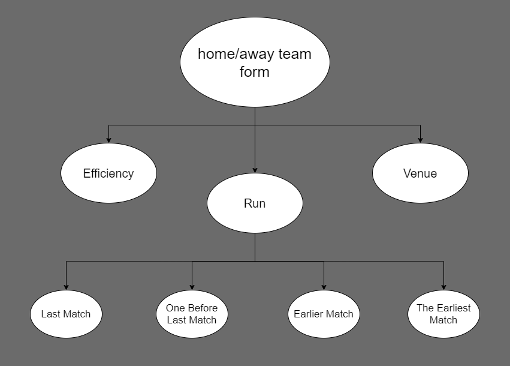

# Anna Kettner (136566) RISA

Projekt polega na stworzeniu systemu przewidującego wyniki meczów piłki nożnej wykorzystującego probabilistyczne modele grafowe. System ma przewidywać jaki będzie wynik następnego meczu, mając do dyspozycji wyniki już rozegranych meczy.

---

# Opis projektu

Opracowany system przewiduje wynik meczu na podstawie formy dwóch drużyn. Do określenia każdej z nich zastosowano probabilistyczny model grafowy, a konkretniej sieć Bayesowską. Korzysta ona z danych dotyczących skuteczności zespołu określanego na podstawie ilości strzelonych i straconych goli, a także miejsca spotkania, uwzględniając przewagę gospodarzy na własnym stadionie. Przede wszystkim brana jest pod uwagę passa danej drużyny, która obliczana jest na podstawie rezultatów czterech ostatnio rozegranych meczów. Większy wpływ na określenie passy zespołu ma ostatni mecz, a każdy kolejny jest mniejszej wagi.

Użytkownik na standardowe wejście podaje 3 łańcuchy znaków oddzielone znakami nowej linii, oznaczające odpowiednio: *Date*, *HomeTeam* oraz *AwayTeam*. Dla każdej drużyny rozgrywającej dany mecz tworzony jest model sieci Bayesowskiej oraz obliczany jest rozkład prawdopodobieństwa formy zespołu.

Wyznaczenie jego wartości odbywa się na podstawie trzech obserwacji. Pierwszą z nich jest *Efficiency*, czyli skuteczność drużyny. Na podstawie strzelonych i straconych goli tworzony jest ranking wszystkich drużyn biorących udział w zawodach. Zespoły na czele zestawienia otrzymują wyższą wartość skuteczności w grze, niż drużyny z końca tabeli. Te z kolei posiadają większą szansę na zremisowanie spotkania. Drugą obserwacją jest *Venue*, czyli miejsce spotkania. Ma ono wpływ na końcowy wynik meczu, ponieważ drużyna gospodarzy posiada większe wsparcie publiczności, które przekłada się na mobilizację zespołu oraz jego efektywność. Zespół grający na wyjeździe ma mniejsze szanse na wygranie meczu. Ostatnią obserwacją jest *Run*, czyli passa zespołu. Określana jest na podstawie czterech ostatnich meczów drużyny. Największy wpływ ma wynik ostatnio rozegranego spotkania, a każde następne brane jest pod uwagę z mniejszą wagą. 

Biorąc pod uwagę wszystkie obserwacje można określić czy mecz wygra drużyna gospodarzy, drużyna gości lub czy spotkanie zakończy się remisem. Należy dokonać zapytania o formę obu zespołów. Otrzymane wartości należy porównać i na ich podstawie podjąć decyzję o predykcji wyniku spotkania. Określane zostaje prawdopodobieństwo zwycięstwa obu zespołów oraz ewentualnych szans na remis. Przewiduje się, że meczy wygra drużyna z najwyższą formą. Jeśli oba zespołu otrzymają podobne wartości, wtedy przewiduje się remis.

# Podsumowanie

Otrzymane wyniki są jedynie prognozą faktycznych rezultatów rozgrywanych spotkań. Są sytuacje, których czasami nie da się przewidzieć, jak np. niedyspozycja zawodnika, niespodziewana choroba gracza lub taktyczne zmiany składu drużyny. Sport jest dziedziną, w której może zdarzyć się wszystko i bardzo trudno jest przewidzieć wynik meczu. Jednak biorąc pod uwagę skuteczność drużyny w całych zawodach, ich aktualną passę oraz miejsce spotkania, można z dobrym przybliżeniem określić prawdopodobny wynik gry.
